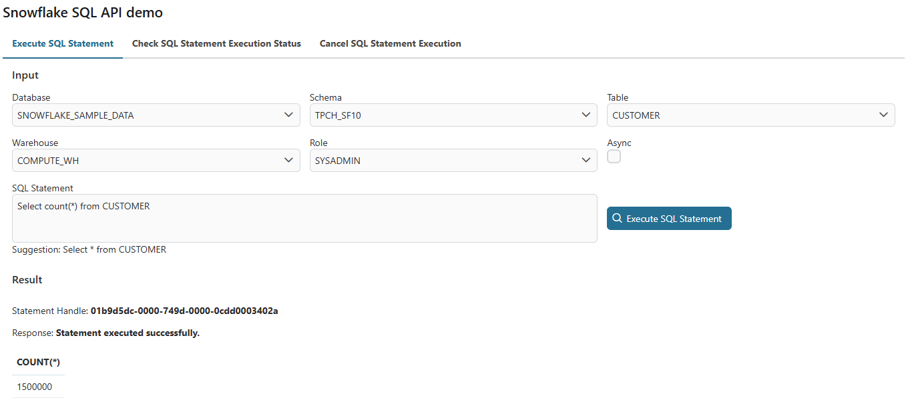
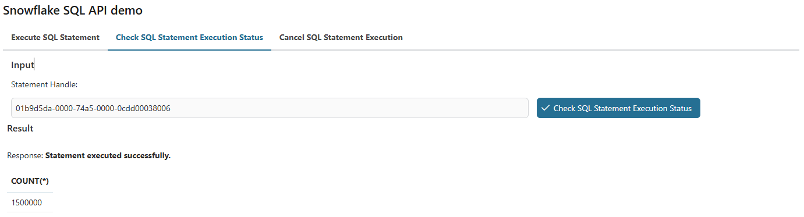
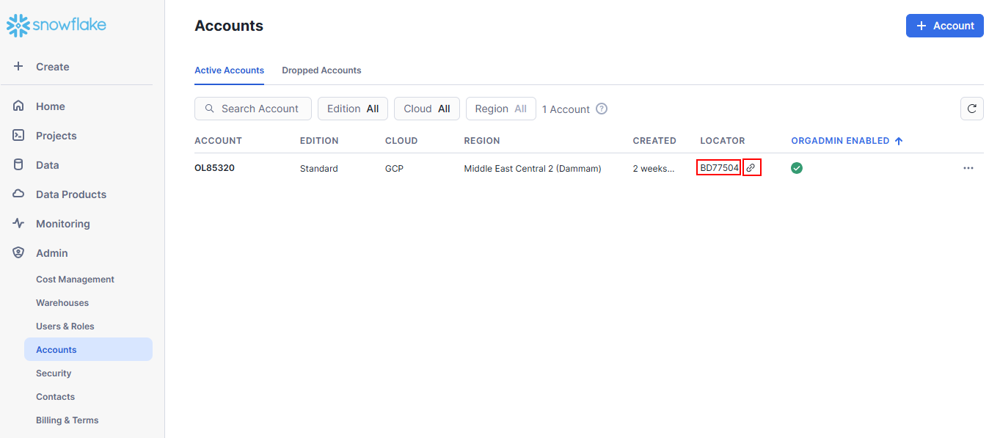

# Snowflake SQL API

Snowflake is a modern, cloud-based data platform that provides scalable and flexible data warehousing, enabling efficient storage, querying, and analysis of large volumes of structured and semi-structured data across multiple cloud providers, including AWS, Azure, and Google Cloud.

This connector:

- supports you with a demo implementation to reduce your integration effort.
- gives you full power to the [Snowflake SQL API](https://docs.snowflake.com/developer-guide/sql-api/index?_fsi=io7jNW4M&_fsi=io7jNW4M#limitations-of-the-sql-api).
- allow you to execute SQL statement on the snowflake's databases.
- allow you to check SQL statement execution status on the snowflake's databases.
- allow you to cancel SQL statement execution on the snowflake's databases.

## Demo

1. Start the process `AccessToSnowflakeDemo/startDemo.ivp`
2. Input the SQL statement and click on the button `Execute SQL Statement` at the tab `Execute SQL Statement`
The result will be displayed on the result section:
- With async query:

- Wihtout async query:

3. Input the statement handle and click on the button `Check SQL Statement Execution Status` at the tab `Check SQL Statement Execution Status`
The result will be displayed on the result section:

4. Input the statement handle and click on the button `Cancel SQL Statement Execution` at the tab `Cancel SQL Statement Execution`
The result will be displayed on the result section:


## Setup

1. Register [Snowflake Account](https://signup.snowflake.com)
2. Sign in to Snowflake
3. Go to the left menu Admin > Accounts to collect `locator` and `locator url` values

4. Refer to [Generate the private key](https://docs.snowflake.com/en/user-guide/key-pair-auth#generate-the-private-key) to generate an unencrypted version.
5. Refer to [Generate a public key](https://docs.snowflake.com/en/user-guide/key-pair-auth#generate-a-public-key) to generate the public key by referencing the private key.
6. Refter to [Assign the public key](https://docs.snowflake.com/en/user-guide/key-pair-auth#assign-the-public-key-to-a-snowflake-user) to assign the public key to a Snowflake user
> [!NOTE]
> You can verify the public key fingerprint by referencing [Verify the user’s public key fingerprint](https://docs.snowflake.com/en/user-guide/key-pair-auth#verify-the-user-s-public-key-fingerprint)
7. Update your `variables.yaml`
> [!NOTE]
> The username must be matched to the username in the profile's Snowflake.

```
@variables.yaml@
```
