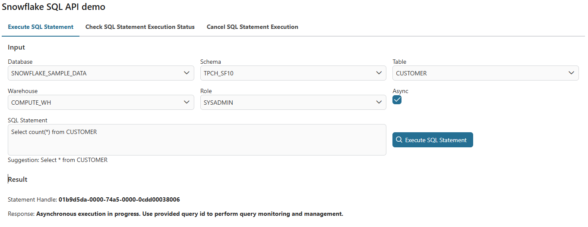
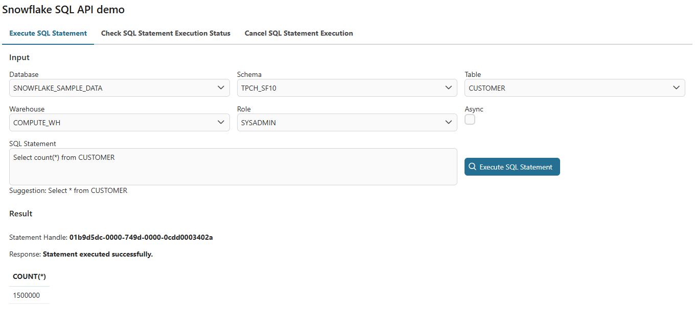
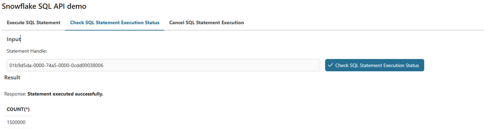
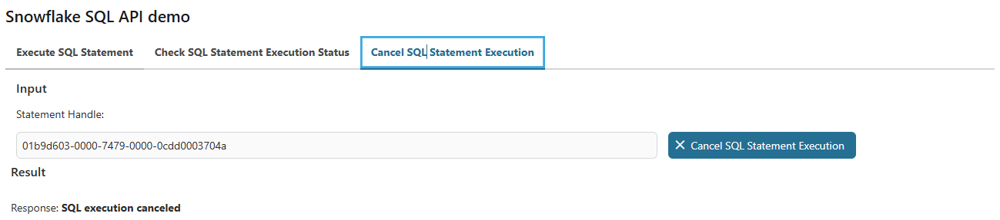
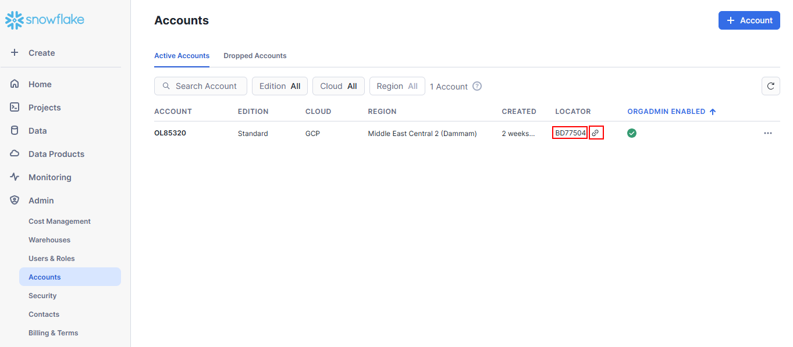

# Schneeflocke SQL API

Schneeflocke ist ein modernes, Wolke-basisbezogener #Daten Bahnsteig versieht
jener scalable und #flexibel #Daten warehousing, aktivierend leistungsstarken
Speicher, #abfragen, und Auswertung von groß Inhalte von #gegliedert und
Halbfinale-#gegliedert #Daten über mehrfach Wolke Provider, #eingerechnet AWS,
Azur und #Google Wolke.

Dieser Anschluss:

- Unterstützt du mit eine Demo Ausführung zu heruntersetzen eure Integration
  Anstrengung.
- Gibt du volle Kraft zu die [Schneeflocke SQL
  API](https://docs.snowflake.com/developer-guide/sql-api/index?_fsi=io7jNW4M&_fsi=io7jNW4M#limitations-of-the-sql-api).
- Erlaub dir zu exekutieren SQL Angabe auf die SchneeflockeDatenbanken.
- Erlaub dir zu überprüfen SQL Angabe Exekution Zustand auf die
  SchneeflockeDatenbanken.
- Erlaub dir zu streichen SQL Angabe Exekution auf die SchneeflockeDatenbanken.

## Demo

1. Starte den Arbeitsgang `AccessToSnowflakeDemo/startDemo.ivp`
2. #Einlesen das SQL Angabe und Klick auf dem Knopf `Exekutiert SQL Angabe` an
   dem Deckel `Exekutiert SQL Angabe` Das Resultat will sein gezeigt auf die
   Resultat Sektion:
- Mit async Anfrage:
  
- Wihtout async Anfrage:
  
3. #Einlesen den Angabe Henkel und klick auf dem Knopf `Überprüft SQL Angabe
   Exekution Zustand` an dem Deckel `Überprüft SQL Angabe Exekution Zustand` Das
   Resultat will sein gezeigt auf die Resultat Sektion:
   
4. #Einlesen den Angabe Henkel und klick auf dem Knopf `Streicht SQL Angabe
   Exekution` an dem Deckel `Streicht SQL Angabe Exekution` Das Resultat will
   sein gezeigt auf die Resultat Sektion:
   

## Einrichtung

1. Register [Schneeflocke Konto](https://signup.snowflake.com)
2. Indiz herein zu Schneeflocke
3. Geh auf der linken Seite Speisekarte Admin > Kontos/Konti/Konten zu
   einsammeln `Zeiger` und `Zeiger url` Werte
   
4. Übergib zu [Generiert den persönlichen
   Schlüssel](https://docs.snowflake.com/en/user-guide/key-pair-auth#generate-the-private-key)
   zu generieren einen unencrypted Version.
5. Übergib zu [Generiert einen öffentlichen
   Schlüssel](https://docs.snowflake.com/en/user-guide/key-pair-auth#generate-a-public-key)
   zu generieren mal den öffentlichen Schlüssel #referenzieren den persönlichen
   Schlüssel.
6. Refter Zu [Weist zu den öffentlichen
   Schlüssel](https://docs.snowflake.com/en/user-guide/key-pair-auth#assign-the-public-key-to-a-snowflake-user)
   zu zuweisen der öffentliche Schlüssel zu einen Schneeflocke Nutzer
> [!BEACHTE] du kannst den öffentlichen Schlüssel Fingerabdruck überprüfen mal
> #referenzieren [Überprüft den Nutzers öffentlichen Schlüssel
> Fingerabdruck](https://docs.snowflake.com/en/user-guide/key-pair-auth#verify-the-user-s-public-key-fingerprint)
> 7. Verbesser eure `Variablen.yaml` [!BEACHTE] Den Benutzernamen muss sein
> gepasst zu dem Benutzernamen in das ProfilsSchneeflocke.

```
@variables.yaml@
```
